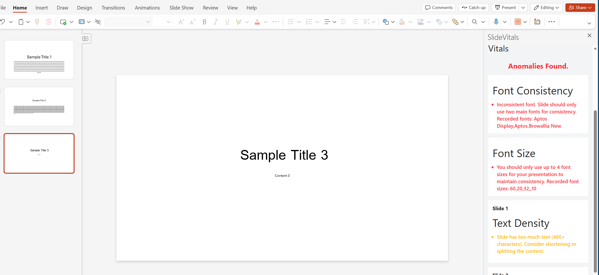

# 📊 Office.js Exploration

A **small exploratory project** built to practice the **Office.js PowerPoint API**.  
It analyzes slides for text-based health metrics and provides automated feedback on font usage and text density.

---

## 🚀 Features

### **1. Font Consistency**
- Detects slides using multiple font families.
- Flags inconsistencies within a slide and across the presentation.

### **2. Font Size Consistency**
- Checks for irregular font sizes within a slide.
- Ensures titles, subtitles, and body text follow a consistent hierarchy.

### **3. Character Density**
- Calculates the number of characters per slide.
- Warns if slides are too text-heavy or exceed recommended readability limits.

---

## 💡 Purpose
This project is **small and intended for learning/exploration**.  

---

## 📷 Screenshots

  

---

## 🛠 Technologies Used
- **Office.js PowerPoint API** – for interacting with slides and text objects  
-  **TypeScript / React** – core logic  
- **HTML & CSS** – UI for displaying results  
